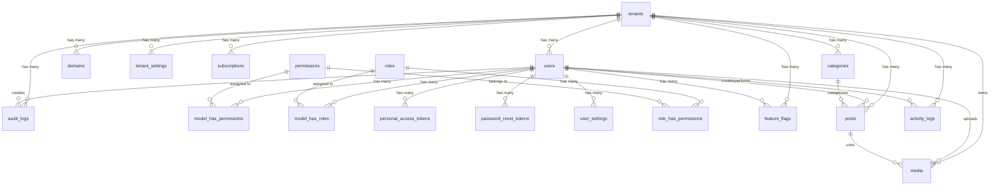

# Filentra - Database Schema & ERD

## 🎯 Overview

This document outlines the database schema for Filentra's multi-tenant SaaS architecture using a single database with tenant scoping approach. The schema supports our modular architecture with proper isolation, RBAC, feature flags, and audit capabilities.

## 📊 Database Strategy

- **Single Database**: All tenants share one database
- **Tenant Scoping**: `tenant_id` column on tenant-specific tables
- **Global Scopes**: Automatic filtering by tenant context
- **Soft Deletes**: Maintain data integrity with soft deletion
- **Audit Trail**: Track all changes for compliance and debugging

## 🏗️ Entity Relationship Diagram



## 📋 Table Definitions

### **Core Tenant Tables**

#### **tenants**
```sql
CREATE TABLE tenants (
    id BIGINT UNSIGNED PRIMARY KEY AUTO_INCREMENT,
    name VARCHAR(255) NOT NULL,
    slug VARCHAR(255) UNIQUE NOT NULL,
    subdomain VARCHAR(255) UNIQUE NOT NULL,
    domain VARCHAR(255) UNIQUE NULL,
    status ENUM('active', 'inactive', 'suspended', 'trial') DEFAULT 'trial',
    plan ENUM('free', 'basic', 'premium', 'enterprise') DEFAULT 'free',
    trial_ends_at TIMESTAMP NULL,
    settings JSON NULL,
    created_at TIMESTAMP DEFAULT CURRENT_TIMESTAMP,
    updated_at TIMESTAMP DEFAULT CURRENT_TIMESTAMP ON UPDATE CURRENT_TIMESTAMP,
    deleted_at TIMESTAMP NULL,
    
    INDEX idx_tenants_subdomain (subdomain),
    INDEX idx_tenants_domain (domain),
    INDEX idx_tenants_status (status),
    INDEX idx_tenants_plan (plan)
);
```

#### **domains**
```sql
CREATE TABLE domains (
    id BIGINT UNSIGNED PRIMARY KEY AUTO_INCREMENT,
    tenant_id BIGINT UNSIGNED NOT NULL,
    domain VARCHAR(255) NOT NULL,
    is_primary BOOLEAN DEFAULT FALSE,
    verified_at TIMESTAMP NULL,
    ssl_enabled BOOLEAN DEFAULT FALSE,
    created_at TIMESTAMP DEFAULT CURRENT_TIMESTAMP,
    updated_at TIMESTAMP DEFAULT CURRENT_TIMESTAMP ON UPDATE CURRENT_TIMESTAMP,
    
    FOREIGN KEY (tenant_id) REFERENCES tenants(id) ON DELETE CASCADE,
    UNIQUE KEY unique_domain (domain),
    INDEX idx_domains_tenant (tenant_id),
    INDEX idx_domains_primary (tenant_id, is_primary)
);
```

#### **subscriptions**
```sql
CREATE TABLE subscriptions (
    id BIGINT UNSIGNED PRIMARY KEY AUTO_INCREMENT,
    tenant_id BIGINT UNSIGNED NOT NULL,
    plan VARCHAR(255) NOT NULL,
    status ENUM('active', 'cancelled', 'past_due', 'unpaid') DEFAULT 'active',
    current_period_start TIMESTAMP NOT NULL,
    current_period_end TIMESTAMP NOT NULL,
    trial_ends_at TIMESTAMP NULL,
    billing_cycle ENUM('monthly', 'yearly') DEFAULT 'monthly',
    amount DECIMAL(10,2) NOT NULL DEFAULT 0.00,
    currency VARCHAR(3) DEFAULT 'USD',
    stripe_subscription_id VARCHAR(255) NULL,
    metadata JSON NULL,
    created_at TIMESTAMP DEFAULT CURRENT_TIMESTAMP,
    updated_at TIMESTAMP DEFAULT CURRENT_TIMESTAMP ON UPDATE CURRENT_TIMESTAMP,
    
    FOREIGN KEY (tenant_id) REFERENCES tenants(id) ON DELETE CASCADE,
    INDEX idx_subscriptions_tenant (tenant_id),
    INDEX idx_subscriptions_status (status),
    INDEX idx_subscriptions_stripe (stripe_subscription_id)
);
```

### **User Management Tables**

#### **users**
```sql
CREATE TABLE users (
    id BIGINT UNSIGNED PRIMARY KEY AUTO_INCREMENT,
    tenant_id BIGINT UNSIGNED NOT NULL,
    name VARCHAR(255) NOT NULL,
    email VARCHAR(255) NOT NULL,
    email_verified_at TIMESTAMP NULL,
    password VARCHAR(255) NOT NULL,
    avatar_url VARCHAR(255) NULL,
    timezone VARCHAR(255) DEFAULT 'UTC',
    language VARCHAR(2) DEFAULT 'en',
    last_login_at TIMESTAMP NULL,
    last_login_ip VARCHAR(45) NULL,
    is_active BOOLEAN DEFAULT TRUE,
    must_verify_email BOOLEAN DEFAULT TRUE,
    two_factor_secret TEXT NULL,
    two_factor_recovery_codes TEXT NULL,
    remember_token VARCHAR(100) NULL,
    created_at TIMESTAMP DEFAULT CURRENT_TIMESTAMP,
    updated_at TIMESTAMP DEFAULT CURRENT_TIMESTAMP ON UPDATE CURRENT_TIMESTAMP,
    deleted_at TIMESTAMP NULL,
    
    FOREIGN KEY (tenant_id) REFERENCES tenants(id) ON DELETE CASCADE,
    UNIQUE KEY unique_email_per_tenant (tenant_id, email),
    INDEX idx_users_tenant (tenant_id),
    INDEX idx_users_email (email),
    INDEX idx_users_active (tenant_id, is_active)
);
```

#### **password_reset_tokens**
```sql
CREATE TABLE password_reset_tokens (
    email VARCHAR(255) PRIMARY KEY,
    tenant_id BIGINT UNSIGNED NOT NULL,
    token VARCHAR(255) NOT NULL,
    created_at TIMESTAMP DEFAULT CURRENT_TIMESTAMP,
    
    FOREIGN KEY (tenant_id) REFERENCES tenants(id) ON DELETE CASCADE,
    INDEX idx_password_reset_tenant (tenant_id)
);
```

#### **personal_access_tokens**
```sql
CREATE TABLE personal_access_tokens (
    id BIGINT UNSIGNED PRIMARY KEY AUTO_INCREMENT,
    tokenable_type VARCHAR(255) NOT NULL,
    tokenable_id BIGINT UNSIGNED NOT NULL,
    tenant_id BIGINT UNSIGNED NOT NULL,
    name VARCHAR(255) NOT NULL,
    token VARCHAR(64) UNIQUE NOT NULL,
    abilities TEXT NULL,
    last_used_at TIMESTAMP NULL,
    expires_at TIMESTAMP NULL,
    created_at TIMESTAMP DEFAULT CURRENT_TIMESTAMP,
    updated_at TIMESTAMP DEFAULT CURRENT_TIMESTAMP ON UPDATE CURRENT_TIMESTAMP,
    
    FOREIGN KEY (tenant_id) REFERENCES tenants(id) ON DELETE CASCADE,
    INDEX idx_personal_access_tokens_tokenable (tokenable_type, tokenable_id),
    INDEX idx_personal_access_tokens_tenant (tenant_id)
);
```

### **RBAC Tables (Spatie Laravel Permission)**

#### **permissions**
```sql
CREATE TABLE permissions (
    id BIGINT UNSIGNED PRIMARY KEY AUTO_INCREMENT,
    name VARCHAR(255) NOT NULL,
    guard_name VARCHAR(255) NOT NULL,
    module VARCHAR(255) NULL,
    resource VARCHAR(255) NULL,
    action VARCHAR(255) NULL,
    scope VARCHAR(255) NULL,
    description TEXT NULL,
    created_at TIMESTAMP DEFAULT CURRENT_TIMESTAMP,
    updated_at TIMESTAMP DEFAULT CURRENT_TIMESTAMP ON UPDATE CURRENT_TIMESTAMP,
    
    UNIQUE KEY unique_permission_guard (name, guard_name),
    INDEX idx_permissions_module (module),
    INDEX idx_permissions_resource (resource),
    INDEX idx_permissions_action (action)
);
```

#### **roles**
```sql
CREATE TABLE roles (
    id BIGINT UNSIGNED PRIMARY KEY AUTO_INCREMENT,
    tenant_id BIGINT UNSIGNED NULL,
    name VARCHAR(255) NOT NULL,
    guard_name VARCHAR(255) NOT NULL,
    description TEXT NULL,
    is_default BOOLEAN DEFAULT FALSE,
    level INTEGER DEFAULT 0,
    created_at TIMESTAMP DEFAULT CURRENT_TIMESTAMP,
    updated_at TIMESTAMP DEFAULT CURRENT_TIMESTAMP ON UPDATE CURRENT_TIMESTAMP,
    
    FOREIGN KEY (tenant_id) REFERENCES tenants(id) ON DELETE CASCADE,
    UNIQUE KEY unique_role_tenant_guard (tenant_id, name, guard_name),
    INDEX idx_roles_tenant (tenant_id),
    INDEX idx_roles_default (tenant_id, is_default)
);
```

#### **model_has_permissions**
```sql
CREATE TABLE model_has_permissions (
    permission_id BIGINT UNSIGNED NOT NULL,
    model_type VARCHAR(255) NOT NULL,
    model_id BIGINT UNSIGNED NOT NULL,
    tenant_id BIGINT UNSIGNED NOT NULL,
    granted_by BIGINT UNSIGNED NULL,
    granted_at TIMESTAMP DEFAULT CURRENT_TIMESTAMP,
    expires_at TIMESTAMP NULL,
    
    PRIMARY KEY (permission_id, model_id, model_type),
    FOREIGN KEY (permission_id) REFERENCES permissions(id) ON DELETE CASCADE,
    FOREIGN KEY (tenant_id) REFERENCES tenants(id) ON DELETE CASCADE,
    FOREIGN KEY (granted_by) REFERENCES users(id) ON DELETE SET NULL,
    INDEX idx_model_has_permissions_model (model_id, model_type),
    INDEX idx_model_has_permissions_tenant (tenant_id)
);
```

#### **model_has_roles**
```sql
CREATE TABLE model_has_roles (
    role_id BIGINT UNSIGNED NOT NULL,
    model_type VARCHAR(255) NOT NULL,
    model_id BIGINT UNSIGNED NOT NULL,
    tenant_id BIGINT UNSIGNED NOT NULL,
    assigned_by BIGINT UNSIGNED NULL,
    assigned_at TIMESTAMP DEFAULT CURRENT_TIMESTAMP,
    
    PRIMARY KEY (role_id, model_id, model_type),
    FOREIGN KEY (role_id) REFERENCES roles(id) ON DELETE CASCADE,
    FOREIGN KEY (tenant_id) REFERENCES tenants(id) ON DELETE CASCADE,
    FOREIGN KEY (assigned_by) REFERENCES users(id) ON DELETE SET NULL,
    INDEX idx_model_has_roles_model (model_id, model_type),
    INDEX idx_model_has_roles_tenant (tenant_id)
);
```

#### **role_has_permissions**
```sql
CREATE TABLE role_has_permissions (
    permission_id BIGINT UNSIGNED NOT NULL,
    role_id BIGINT UNSIGNED NOT NULL,
    
    PRIMARY KEY (permission_id, role_id),
    FOREIGN KEY (permission_id) REFERENCES permissions(id) ON DELETE CASCADE,
    FOREIGN KEY (role_id) REFERENCES roles(id) ON DELETE CASCADE
);
```

### **Feature Flag Tables (Laravel Pennant)**

#### **feature_flags**
```sql
CREATE TABLE feature_flags (
    id BIGINT UNSIGNED PRIMARY KEY AUTO_INCREMENT,
    name VARCHAR(255) NOT NULL,
    scope_type VARCHAR(255) NOT NULL, -- 'tenant', 'user', 'global'
    scope_id BIGINT UNSIGNED NULL,
    value JSON NOT NULL,
    enabled BOOLEAN DEFAULT TRUE,
    rollout_percentage INTEGER DEFAULT 0, -- 0-100
    metadata JSON NULL,
    created_at TIMESTAMP DEFAULT CURRENT_TIMESTAMP,
    updated_at TIMESTAMP DEFAULT CURRENT_TIMESTAMP ON UPDATE CURRENT_TIMESTAMP,
    
    UNIQUE KEY unique_feature_scope (name, scope_type, scope_id),
    INDEX idx_feature_flags_scope (scope_type, scope_id),
    INDEX idx_feature_flags_name (name),
    INDEX idx_feature_flags_enabled (enabled)
);
```

### **Settings Tables**

#### **tenant_settings**
```sql
CREATE TABLE tenant_settings (
    id BIGINT UNSIGNED PRIMARY KEY AUTO_INCREMENT,
    tenant_id BIGINT UNSIGNED NOT NULL,
    key VARCHAR(255) NOT NULL,
    value JSON NULL,
    type ENUM('string', 'integer', 'boolean', 'array', 'object') DEFAULT 'string',
    is_public BOOLEAN DEFAULT FALSE,
    created_at TIMESTAMP DEFAULT CURRENT_TIMESTAMP,
    updated_at TIMESTAMP DEFAULT CURRENT_TIMESTAMP ON UPDATE CURRENT_TIMESTAMP,
    
    FOREIGN KEY (tenant_id) REFERENCES tenants(id) ON DELETE CASCADE,
    UNIQUE KEY unique_tenant_setting (tenant_id, key),
    INDEX idx_tenant_settings_public (tenant_id, is_public)
);
```

#### **user_settings**
```sql
CREATE TABLE user_settings (
    id BIGINT UNSIGNED PRIMARY KEY AUTO_INCREMENT,
    user_id BIGINT UNSIGNED NOT NULL,
    tenant_id BIGINT UNSIGNED NOT NULL,
    key VARCHAR(255) NOT NULL,
    value JSON NULL,
    type ENUM('string', 'integer', 'boolean', 'array', 'object') DEFAULT 'string',
    created_at TIMESTAMP DEFAULT CURRENT_TIMESTAMP,
    updated_at TIMESTAMP DEFAULT CURRENT_TIMESTAMP ON UPDATE CURRENT_TIMESTAMP,
    
    FOREIGN KEY (user_id) REFERENCES users(id) ON DELETE CASCADE,
    FOREIGN KEY (tenant_id) REFERENCES tenants(id) ON DELETE CASCADE,
    UNIQUE KEY unique_user_setting (user_id, key),
    INDEX idx_user_settings_tenant (tenant_id)
);
```

### **Audit & Logging Tables**

#### **audit_logs**
```sql
CREATE TABLE audit_logs (
    id BIGINT UNSIGNED PRIMARY KEY AUTO_INCREMENT,
    tenant_id BIGINT UNSIGNED NOT NULL,
    user_id BIGINT UNSIGNED NULL,
    event VARCHAR(255) NOT NULL,
    auditable_type VARCHAR(255) NOT NULL,
    auditable_id BIGINT UNSIGNED NOT NULL,
    old_values JSON NULL,
    new_values JSON NULL,
    url TEXT NULL,
    ip_address VARCHAR(45) NULL,
    user_agent TEXT NULL,
    tags VARCHAR(255) NULL,
    created_at TIMESTAMP DEFAULT CURRENT_TIMESTAMP,
    
    FOREIGN KEY (tenant_id) REFERENCES tenants(id) ON DELETE CASCADE,
    FOREIGN KEY (user_id) REFERENCES users(id) ON DELETE SET NULL,
    INDEX idx_audit_logs_tenant (tenant_id),
    INDEX idx_audit_logs_user (user_id),
    INDEX idx_audit_logs_auditable (auditable_type, auditable_id),
    INDEX idx_audit_logs_event (event),
    INDEX idx_audit_logs_created (created_at)
);
```

#### **activity_logs**
```sql
CREATE TABLE activity_logs (
    id BIGINT UNSIGNED PRIMARY KEY AUTO_INCREMENT,
    tenant_id BIGINT UNSIGNED NOT NULL,
    log_name VARCHAR(255) NULL,
    description TEXT NOT NULL,
    subject_type VARCHAR(255) NULL,
    subject_id BIGINT UNSIGNED NULL,
    causer_type VARCHAR(255) NULL,
    causer_id BIGINT UNSIGNED NULL,
    properties JSON NULL,
    batch_uuid CHAR(36) NULL,
    event VARCHAR(255) NULL,
    created_at TIMESTAMP DEFAULT CURRENT_TIMESTAMP,
    
    FOREIGN KEY (tenant_id) REFERENCES tenants(id) ON DELETE CASCADE,
    INDEX idx_activity_logs_tenant (tenant_id),
    INDEX idx_activity_logs_subject (subject_type, subject_id),
    INDEX idx_activity_logs_causer (causer_type, causer_id),
    INDEX idx_activity_logs_batch (batch_uuid),
    INDEX idx_activity_logs_created (created_at)
);
```

### **File Management Tables**

#### **media**
```sql
CREATE TABLE media (
    id BIGINT UNSIGNED PRIMARY KEY AUTO_INCREMENT,
    tenant_id BIGINT UNSIGNED NOT NULL,
    user_id BIGINT UNSIGNED NULL,
    collection_name VARCHAR(255) NOT NULL,
    name VARCHAR(255) NOT NULL,
    file_name VARCHAR(255) NOT NULL,
    mime_type VARCHAR(255) NULL,
    disk VARCHAR(255) NOT NULL,
    conversions_disk VARCHAR(255) NULL,
    size BIGINT UNSIGNED NOT NULL,
    manipulations JSON NULL,
    custom_properties JSON NULL,
    generated_conversions JSON NULL,
    responsive_images JSON NULL,
    order_column INTEGER UNSIGNED NULL,
    created_at TIMESTAMP DEFAULT CURRENT_TIMESTAMP,
    updated_at TIMESTAMP DEFAULT CURRENT_TIMESTAMP ON UPDATE CURRENT_TIMESTAMP,
    
    FOREIGN KEY (tenant_id) REFERENCES tenants(id) ON DELETE CASCADE,
    FOREIGN KEY (user_id) REFERENCES users(id) ON DELETE SET NULL,
    INDEX idx_media_tenant (tenant_id),
    INDEX idx_media_user (user_id),
    INDEX idx_media_collection (collection_name),
    INDEX idx_media_created (created_at)
);
```

### **Example Module Tables**

#### **categories** (Example Content Module)
```sql
CREATE TABLE categories (
    id BIGINT UNSIGNED PRIMARY KEY AUTO_INCREMENT,
    tenant_id BIGINT UNSIGNED NOT NULL,
    parent_id BIGINT UNSIGNED NULL,
    name VARCHAR(255) NOT NULL,
    slug VARCHAR(255) NOT NULL,
    description TEXT NULL,
    is_active BOOLEAN DEFAULT TRUE,
    sort_order INTEGER DEFAULT 0,
    metadata JSON NULL,
    created_at TIMESTAMP DEFAULT CURRENT_TIMESTAMP,
    updated_at TIMESTAMP DEFAULT CURRENT_TIMESTAMP ON UPDATE CURRENT_TIMESTAMP,
    deleted_at TIMESTAMP NULL,
    
    FOREIGN KEY (tenant_id) REFERENCES tenants(id) ON DELETE CASCADE,
    FOREIGN KEY (parent_id) REFERENCES categories(id) ON DELETE SET NULL,
    UNIQUE KEY unique_category_slug_tenant (tenant_id, slug),
    INDEX idx_categories_tenant (tenant_id),
    INDEX idx_categories_parent (parent_id),
    INDEX idx_categories_active (tenant_id, is_active)
);
```

#### **posts** (Example Content Module)
```sql
CREATE TABLE posts (
    id BIGINT UNSIGNED PRIMARY KEY AUTO_INCREMENT,
    tenant_id BIGINT UNSIGNED NOT NULL,
    user_id BIGINT UNSIGNED NOT NULL,
    category_id BIGINT UNSIGNED NULL,
    title VARCHAR(255) NOT NULL,
    slug VARCHAR(255) NOT NULL,
    excerpt TEXT NULL,
    content LONGTEXT NULL,
    status ENUM('draft', 'published', 'archived') DEFAULT 'draft',
    published_at TIMESTAMP NULL,
    featured_image_id BIGINT UNSIGNED NULL,
    views_count INTEGER DEFAULT 0,
    metadata JSON NULL,
    created_at TIMESTAMP DEFAULT CURRENT_TIMESTAMP,
    updated_at TIMESTAMP DEFAULT CURRENT_TIMESTAMP ON UPDATE CURRENT_TIMESTAMP,
    deleted_at TIMESTAMP NULL,
    
    FOREIGN KEY (tenant_id) REFERENCES tenants(id) ON DELETE CASCADE,
    FOREIGN KEY (user_id) REFERENCES users(id) ON DELETE CASCADE,
    FOREIGN KEY (category_id) REFERENCES categories(id) ON DELETE SET NULL,
    FOREIGN KEY (featured_image_id) REFERENCES media(id) ON DELETE SET NULL,
    UNIQUE KEY unique_post_slug_tenant (tenant_id, slug),
    INDEX idx_posts_tenant (tenant_id),
    INDEX idx_posts_user (user_id),
    INDEX idx_posts_category (category_id),
    INDEX idx_posts_status (tenant_id, status),
    INDEX idx_posts_published (published_at),
    FULLTEXT idx_posts_search (title, excerpt, content)
);
```

## 🔐 Security Considerations

### **Tenant Isolation**
```sql
-- Global scope for all tenant-scoped models
SELECT * FROM users WHERE tenant_id = ? AND id = ?;
SELECT * FROM posts WHERE tenant_id = ? AND slug = ?;
```

### **Row Level Security (Future)**
```sql
-- Example RLS policy (if migrating to PostgreSQL)
CREATE POLICY tenant_isolation ON users
    FOR ALL TO app_user
    USING (tenant_id = current_setting('app.current_tenant_id')::bigint);
```

### **Encryption Fields**
```sql
-- Sensitive fields that should be encrypted
-- two_factor_secret, two_factor_recovery_codes
-- password_reset_tokens.token
-- personal_access_tokens.token
```

## 📊 Indexes Strategy

### **Performance Indexes**
```sql
-- Tenant-based queries
CREATE INDEX idx_tenant_user_active ON users(tenant_id, is_active);
CREATE INDEX idx_tenant_post_status ON posts(tenant_id, status, published_at);

-- Search indexes
CREATE FULLTEXT INDEX idx_posts_search ON posts(title, excerpt, content);
CREATE INDEX idx_users_email ON users(email);

-- Audit and logging
CREATE INDEX idx_audit_created_tenant ON audit_logs(created_at, tenant_id);
CREATE INDEX idx_activity_batch_tenant ON activity_logs(batch_uuid, tenant_id);
```

### **Composite Indexes**
```sql
-- Common query patterns
CREATE INDEX idx_user_permissions ON model_has_permissions(model_id, model_type, tenant_id);
CREATE INDEX idx_user_roles ON model_has_roles(model_id, model_type, tenant_id);
CREATE INDEX idx_feature_scope_enabled ON feature_flags(scope_type, scope_id, enabled);
```

## 🔄 Migration Strategy

### **Migration Order**
1. **Core Tables**: `tenants`, `domains`
2. **User Management**: `users`, `password_reset_tokens`, `personal_access_tokens`
3. **RBAC**: `permissions`, `roles`, `model_has_*`, `role_has_permissions`
4. **Feature Flags**: `feature_flags`
5. **Settings**: `tenant_settings`, `user_settings`
6. **Audit**: `audit_logs`, `activity_logs`
7. **Media**: `media`
8. **Module Tables**: `categories`, `posts` (examples)

### **Seeder Strategy**
```php
// Default permissions for all modules
php artisan db:seed --class=PermissionSeeder

// Default roles (Admin, Manager, User)
php artisan db:seed --class=RoleSeeder

// Sample tenant with admin user
php artisan db:seed --class=TenantSeeder

// Sample content for development
php artisan db:seed --class=DevelopmentSeeder
```

## 🧪 Testing Data Structure

### **Test Factories**
```php
// Tenant factory with unique subdomains
TenantFactory::create(['subdomain' => 'test-' . uniqid()]);

// User factory with tenant scoping
UserFactory::for($tenant)->create();

// Content factory with relationships
PostFactory::for($tenant)->has(CategoryFactory::count(3))->create();
```

### **Parallel Testing Considerations**
- Use unique tenant subdomains for each test
- Isolate test data by tenant
- Clean up strategy between test runs
- Avoid global state dependencies

## 📈 Scalability Considerations

### **Horizontal Scaling**
- Read replicas for heavy read workloads
- Database sharding by tenant_id (future)
- CDN for media files
- Redis for sessions and cache

### **Vertical Scaling**
- Proper indexing strategy
- Query optimization
- Connection pooling
- Background job processing

### **Monitoring**
- Slow query logging
- Table size monitoring
- Index usage statistics
- Tenant resource consumption

This schema provides a solid foundation for a multi-tenant SaaS application with proper isolation, security, and scalability considerations while maintaining simplicity and developer productivity.